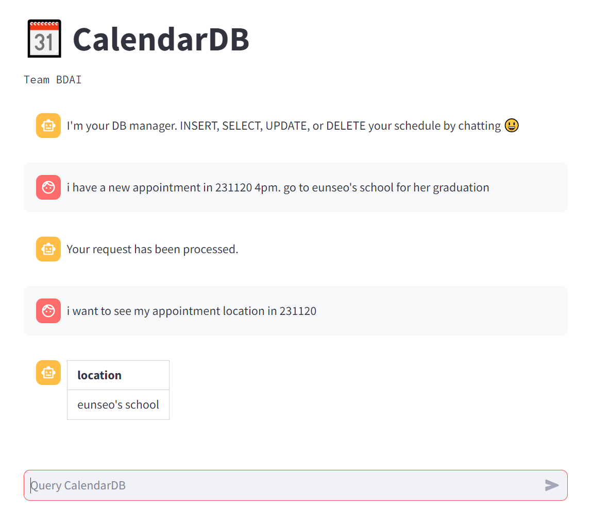
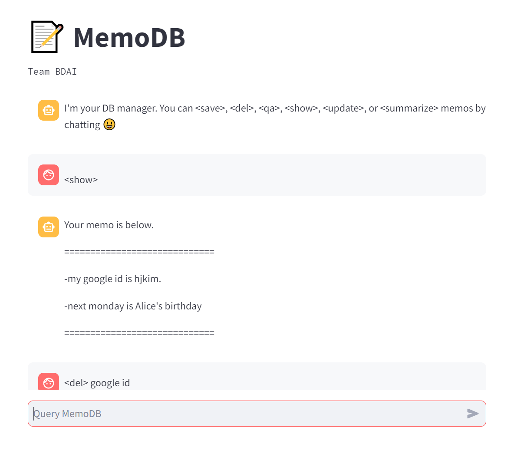

##### 서울대학교 2023-2 대화형 자연어처리 수업 Team BDAI의 ChatGPT Mini-Project Repository입니다.
--------
# LangLog

LangLog는 Langchain을 이용한 챗봇 형식의 개인 일정 및 메모 관리 어플리케이션입니다.  
  
## Requirements
### 가상환경 생성
```
conda create -n convai python=3.10
conda activate convai
pip install -r requirements.txt
```

### DB Config & OpenAI API Key 입력
- 로컬에 MySQL 설치 (DB명, 패스워드 필요)
- OpenAI API Key 발급
- CalendarDB.py와 MemoDB.py의 '사용자가 입력' 부분에 OPENAI_API_KEY, db_config 입력

## Usage
```
# CalendarDB
conda activate convai
streamlit run CalendarDB.py

# MemoDB
conda activate convai
streamlit run MemoDB.py
```

## Screenshots
<p align="center">
  
  
</p>
